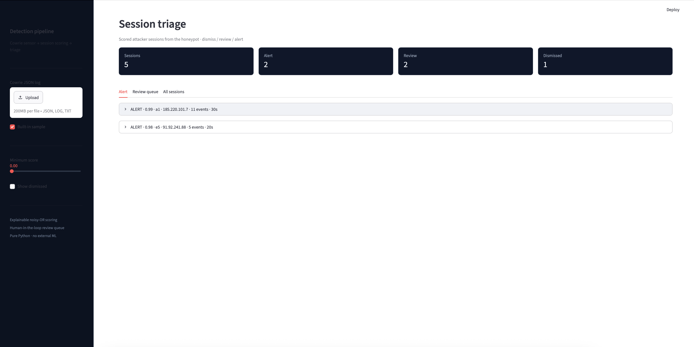
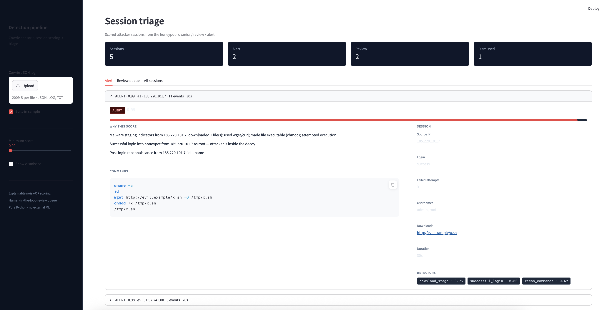
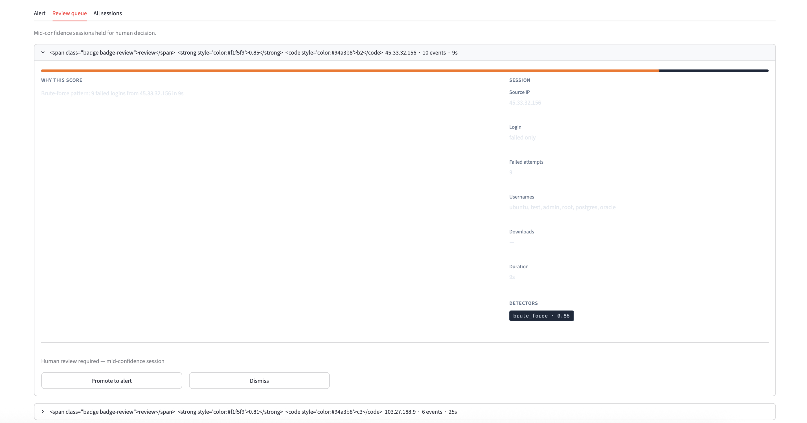
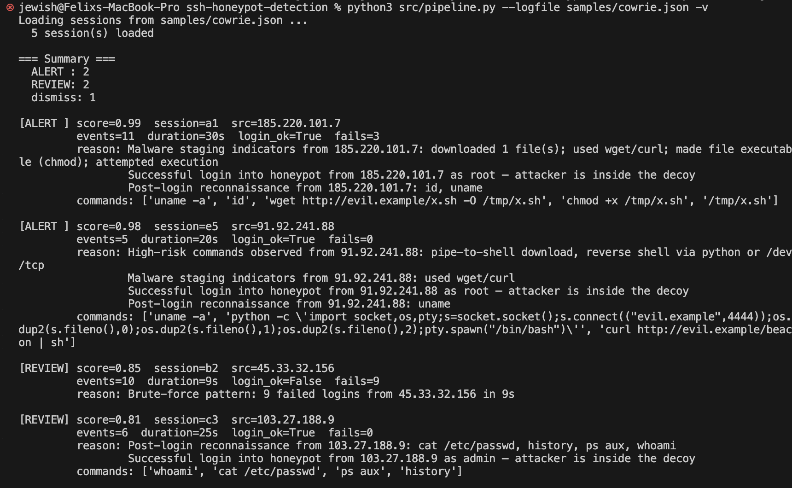

# SSH Honeypot Detection Pipeline

[](https://docs.docker.com/compose/)
[](https://github.com/cowrie/cowrie)
[](https://wazuh.com/)
[](https://www.python.org/)
[](LICENSE)

Cowrie-based SSH/Telnet honeypot with a pure-Python analysis layer that reconstructs attacker sessions, scores them with explainable detectors, and routes mid-confidence cases to human review.

The detection engine uses only the Python standard library. Docker Compose is optional and provides a live Cowrie (+ Wazuh) data source.

---

## Screenshots

### Triage dashboard







### CLI



---

## What it does

| Component | Role |
| --- | --- |
| Session reconstruction | Groups Cowrie JSON events into attacker sessions |
| Detectors | Brute-force, successful login, recon, malware staging, reverse-shell patterns, interactive use |
| Scoring | Noisy-OR combination of detector severities; plain-English reasons on every finding |
| Triage | `dismiss` / `review` / `alert` buckets; review queue for human decision |
| Optional SIEM path | Custom Wazuh decoder + rules as a first-stage filter |
| Safety defaults | Non-standard port (2222), `forward_redirect=false` |

Same design approach as [log-anomaly-detection-pipeline](https://github.com/Jewish5782/log-anomaly-detection-pipeline): explainable scores, human-in-the-loop, session-centric analysis.

---

## Architecture

```
Attacker ──SSH:2222──▶ Cowrie ──JSON──▶ log file / volume
                                          │
                    ┌─────────────────────┼──────────────────┐
                    ▼                     ▼                  ▼
             Wazuh (optional)      Python pipeline      Streamlit UI
          custom decoder/rules     detectors + scoring   triage view
                    │                     │
                    ▼                     ▼
             Wazuh dashboard         CLI + JSON out
```

---

## Quick start

### Offline (no Docker)

```bash
python3 -m venv .venv
source .venv/bin/activate

python3 samples/generate_samples.py
python3 src/pipeline.py --logfile samples/cowrie.json -v

pip install streamlit
streamlit run src/dashboard.py
```

### Live Cowrie (+ optional Wazuh)

```bash
chmod +x scripts/*.sh
./scripts/setup.sh
docker compose up -d

./scripts/generate_traffic.sh

# analyse Cowrie JSON with the Python pipeline
# (copy log out if the container has no cat/tail)
docker cp cowrie:/cowrie/cowrie-git/var/log/cowrie/cowrie.json /tmp/live.json
python3 src/pipeline.py --logfile /tmp/live.json -v
```

Wazuh UI (if enabled): https://localhost:5601

---

## Detectors

| Detector | Signal |
| --- | --- |
| `brute_force` | Multiple failed logins in a short window |
| `successful_login` | Login into the decoy |
| `recon_commands` | uname, id, whoami, cat /etc/passwd, ps, … |
| `download_stage` | wget/curl + chmod + execution |
| `suspicious_commands` | Reverse shells, pipe-to-shell, netcat, miners |
| `interactive_session` | Long or command-heavy sessions |

### Scoring

```
score = 1 - Π (1 - severityᵢ)
```

| Score | Disposition |
| --- | --- |
| < 0.30 | dismiss |
| 0.30 – 0.89 | review (human) |
| ≥ 0.90 | alert |

---

## Layout

```
src/
  models.py        Event, Session, Finding
  parsers.py       Cowrie JSON → sessions
  detectors.py     Independent detectors
  scoring.py       Noisy-OR + buckets
  pipeline.py      CLI
  dashboard.py     Streamlit triage UI
samples/
  generate_samples.py
  cowrie.json
tests/
  test_pipeline.py
wazuh/
  decoders/        Custom Cowrie decoder
  rules/           Rule IDs 100101–100110
scripts/
  setup.sh
  generate_traffic.sh
  validate.py
docs/              Screenshots
```

---

## Tests

```bash
python3 -m unittest discover -s tests -v
```

---

## Safety

- Listens on **2222**, not 22
- `forward_redirect = false` (no outbound abuse via the honeypot)
- Do not put real credentials or hostnames in the decoy filesystem
- Change default Wazuh passwords before any network exposure

---

## License

MIT — see [LICENSE](LICENSE).
